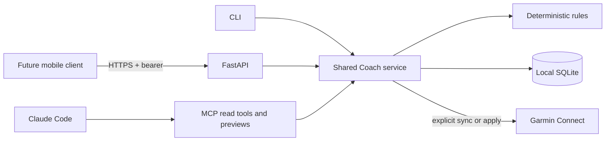

# Architecture and operational boundaries

`models.py` defines validated inputs and records. `engine.py` and the proposal calculations
in `adaptation.py` are deterministic and have no Garmin or LLM dependency. `storage.py`
keeps one plan, normalized activities, remote workout mappings,
write-intent metadata, sync coverage, and applied adjustments in SQLite.
`adaptation.week_metrics` computes matches from the current plan and activities on demand.
Applied plan changes and their adjustment record commit in one transaction.
`service.py` owns application operations and typed
request/response models. CLI, FastAPI, and MCP are thin transports over `service.Coach`.
`mcp.py` opens the same file with SQLite `mode=ro` and exposes only read-only operations.
`api.py` authenticates before opening a request-scoped SQLite connection; HTTP workers never
share connections. The generated `docs/openapi.json` is the mobile-client contract.

## Garmin boundary

The pinned garth-compatible library loads the two saved token files directly. No code path
calls its `login` method. Automatic token refresh is replaced with a clear failure, and
HTTP retries are disabled. An expired session stops without reauthentication or token writes.
Garmin errors are sanitized rather than printing upstream request/response bodies.

Workout upload and activity reads use python-garminconnect public methods. The pinned release
lacks scheduling, update, and delete helpers, so these use its garth transport with upstream
workout-service endpoints. Calendar reads use calendar-service with zero-based months.
Target identifiers follow the current upstream schema: pace.zone=6 (metres/second),
heart.rate.zone=4 (bpm). See [upstream workout models](
https://github.com/cyberjunky/python-garminconnect/blob/master/garminconnect/workout.py) and
[upstream API methods](https://github.com/cyberjunky/python-garminconnect).

Garmin's API is unofficial and may change. The fake-response tests validate request shape
and control flow, not a live Garmin contract or watch behavior. Verify one real workout
only after merge, following the README.

## Idempotency and uncertainty

A deterministic plan identifier plus workout date forms the ownership marker. Reconciliation
pages through all remote workouts, fetches candidate details, and requires an exact marker
before updating or deleting. It checks remote calendar entries before scheduling. Changed
local workouts retain their remote ID. Existing local mappings never authorize reclaiming
an unmarked remote workout.

A local file lock serializes push, removal, sync, and adaptation for the same database.
Sync holds this lock throughout fetching and saving, so concurrent fetches cannot commit snapshots out of order.
Activity replacement and fetched-range and complete-day coverage records commit in one SQLite transaction.
The latest sync replaces both coverage records, rather than merging coverage across separate syncs.
See the [weekly loop](../README.md#weekly-loop) for adaptation coverage requirements.

Before create or schedule, a committed intent marks the operation pending. A response lost
after Garmin accepted a write can be recovered from the ownership tag/calendar entry.
If that evidence is missing, retry stops. This trades automatic availability for avoiding
duplicate remote writes; there is no claim of distributed exactly-once delivery.

Do not run concurrent writers from separate database copies. Do not manually delete the
write-intent metadata to bypass uncertainty. Removing a pending upload that cannot be found
also stops. Manual Garmin renames, marker deletion, or moving calendar entries outside the
planned month may require manual inspection. `remove` is scoped to the active local plan.

## Data and testing

Garmin's local activity date is used for matching. Original titles, locations, raw exports,
and tokens are not stored. Generic Garmin running activities have unknown session type;
inferred matches are labeled. Normalized imports can supply a `kind`. Best-effort status
must be supplied explicitly; it is never guessed from an ordinary activity title.

The CLI's JSON output is intended for inspection and scripts. The MCP process reserves
stdout for stdio protocol traffic. Tests replace network entry points with failures and
use synthetic data. `examples/offline_demo.py` is an executable demonstration of the local
loop. No live Garmin write belongs in tests or CI.

## HTTP authentication and concurrency

The API requires one configured secret through `STRIDE_COACH_API_TOKEN`, with a minimum
length of 32 characters and constant-time comparison. It does not issue tokens or host user
accounts. Every data route and the runtime OpenAPI endpoint require bearer authentication.
CORS allows only configured exact origins and the needed methods/headers. Deployment uses
HTTPS at a trusted reverse proxy; the built-in server defaults to loopback and disables
request access logging. `serve` validates configuration before accepting traffic.

Each HTTP request has its own SQLite connection; thread checking is disabled because a
FastAPI sync dependency and handler can run on different worker threads. The connection is
never shared between requests. Existing process locks and SQLite transactions also coordinate
API writes with CLI writes against the same database. There is no server-side background job.

`examples/api_demo.py` launches and stops only its own temporary loopback server and uses an
ephemeral bearer secret. It performs no Garmin calls. API tests use FastAPI TestClient and
validate authentication, CORS, typed errors, dry-run defaults, explicit writes, adaptation,
service parity, and schema drift.
