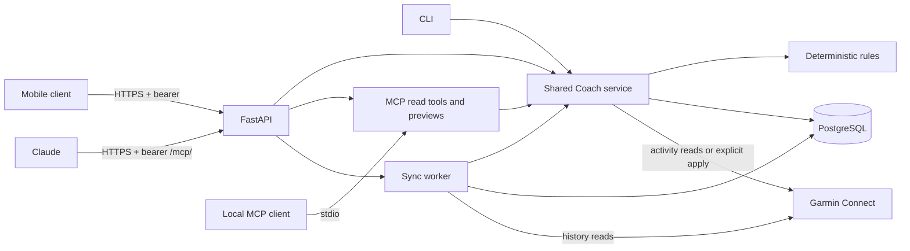

# Architecture and operational boundaries

`models.py` defines validated inputs and records. `engine.py` and the proposal calculations
in `adaptation.py` are deterministic and have no Garmin or LLM dependency. `storage.py`
keeps one plan, normalized activities, remote workout mappings,
write intents, typed sync coverage, and applied adjustments in PostgreSQL.
`db_models.py` defines SQLAlchemy typed columns, enums, foreign keys, and the single-plan constraint.
Packaged Alembic revisions apply at API startup or through `stride-coach db upgrade`.
Core records are relational. See [run data storage](activity-data.md) for detail storage and raw provider payloads.
`adaptation.week_metrics` computes matches from the current plan and activities on demand.
A relational match table is refreshed transactionally after initialization, sync, import, and adaptation.
Applied plan changes and their adjustment record commit in one transaction.
`service.py` owns application operations and typed
request/response models. CLI, FastAPI, and MCP are thin transports over `service.Coach`.
`mcp.py` uses PostgreSQL read-only transactions and exposes only read-only operations.
It checks schema compatibility but never applies migrations.
FastAPI mounts the same tools at `/mcp/` using stateless Streamable HTTP and owns the MCP
session-manager lifespan. Middleware checks the API bearer token on dispatched MCP requests,
including mount redirects, and rejects browser Origins outside the configured CORS list.
The HTTPS proxy handles public host routing. The local stdio entry point remains available.
Data routes authenticate before opening a request-scoped PostgreSQL connection.
The public health probe opens its own connection without authentication. HTTP requests never share connections.
The generated `docs/openapi.json` is the mobile-client contract.

## Garmin boundary

`garmin_auth.py` owns login, MFA, private token persistence, and bounded renewal using the
pinned garth SSO functions. A password is submitted once per explicit request, without retries.
Pending MFA state lives in memory for five minutes; submitted request bodies are scrubbed from
garth's retained response before keeping a challenge. Passwords are never persisted.
The CLI and authenticated HTTP routes share this manager. MCP only reads PostgreSQL and never contacts Garmin.
A PostgreSQL session advisory lock and atomic private-file replacement protect token persistence. A generation
marker prevents a pending login or an older session from restoring tokens after logout or a
new connection. Unmarked nonempty stores and shared Garmin paths are refused.
`StoredSession` wraps both proactive and implicit garth renewal with one attempt per request.
HTTP retries are disabled. Upstream exceptions and request validation inputs are sanitized.
Use one API process/worker because MFA challenges are not shared between workers. See the
[self-hosting guide](self-hosting.md) for volume setup and the
[README Garmin section](../README.md#garmin-authentication-and-first-live-check) for security boundaries and upstream compatibility limits.

Workout uploads and regular activity reads use python-garminconnect public methods.
History pages use its garth transport with activity-service parameters for date range, offset, and ascending order. The pinned release
lacks scheduling, update, and delete helpers, so these use its garth transport with upstream
workout-service endpoints. Calendar reads use calendar-service with zero-based months.
Target identifiers follow the current upstream schema: pace.zone=6 (metres/second),
heart.rate.zone=4 (bpm). See [upstream workout models](
https://github.com/cyberjunky/python-garminconnect/blob/master/garminconnect/workout.py) and
[upstream API methods](https://github.com/cyberjunky/python-garminconnect).

Garmin's API is unofficial and may change. The fake-response tests validate request shape
and control flow, not a live Garmin contract or watch behavior. Verify one real workout
only after merge, following the README.

## Idempotency and uncertainty

A deterministic plan identifier plus workout date forms the ownership marker. Reconciliation
pages through all remote workouts, fetches candidate details, and requires an exact marker
before updating or deleting. It checks remote calendar entries before scheduling. Changed
local workouts retain their remote ID. Existing local mappings never authorize reclaiming
an unmarked remote workout.

A PostgreSQL session advisory lock serializes push, removal, sync, and adaptation in the same database.
The lock uses the same connection as ledger writes and survives their commits. PostgreSQL releases
it when that connection closes. Migrations and token persistence use separate advisory keys.
Use direct or session-pooled connections; transaction pooling is unsupported.
Sync holds this lock throughout fetching and saving, so concurrent fetches cannot commit snapshots out of order.
Activity upserts and fetched-range and complete-day coverage records commit in one PostgreSQL transaction.
See [sync behavior](../README.md#plan-and-review) for activity preservation and offline import requirements.
The latest sync replaces both coverage records, rather than merging coverage across separate syncs.
See the [weekly loop](../README.md#weekly-loop) for adaptation coverage requirements.

Before create or schedule, a committed intent marks the operation pending. A response lost
after Garmin accepted a write can be recovered from the ownership tag/calendar entry.
If that evidence is missing, retry stops. This trades automatic availability for avoiding
duplicate remote writes; there is no claim of distributed exactly-once delivery.

Before unscheduling a cached workout, the server commits an intent, a record of the pending operation.
This record survives failed reads and process restarts. On retry, fresh ownership and calendar evidence
must show that the schedule is absent before the server clears its cached scheduling state.

If inventory and calendar reads show that the remote workout is gone, the server clears its cached mapping.
A pending upload still blocks this cleanup. These rules let interrupted removals recover when the calendar window advances.
See the removal recovery regressions in [test_garmin_calendar.py](../tests/test_garmin_calendar.py).

Do not run concurrent writers from separate database copies. Do not manually delete the
write-intent metadata to bypass uncertainty. Removing a pending upload that cannot be found
also stops. Marker deletion or calendar entries outside the planned month can require manual inspection.
See [workout ownership and migration](garmin-workouts.md#ownership-and-migration) for renamed workouts and discovery reads.
`remove` is scoped to the active local plan.

## Data and testing

Garmin's local activity date is used for matching.
See [original files and privacy](activity-data.md#original-files-and-privacy) for retained data and GPS controls.
OAuth tokens and an optional account display name live only in the private connection store.
Generic Garmin running activities have unknown session type; inferred matches are labeled. Normalized imports can supply a `kind`. Best-effort status
must be supplied explicitly; it is never guessed from an ordinary activity title.

The CLI's JSON output is intended for inspection and scripts. The standalone stdio MCP process reserves
stdout for stdio protocol traffic. See the [test setup](self-hosting.md#local-offline-tests-and-synthetic-proof)
for PostgreSQL requirements and synthetic demos. No live Garmin write belongs in tests or CI.

## HTTP authentication and concurrency

The API requires one configured secret through `STRIDE_COACH_API_TOKEN`, with a minimum
length of 32 characters and constant-time comparison. It does not issue tokens or host user
accounts. Data routes and the runtime OpenAPI endpoint require bearer authentication.
The public pairing exchange transfers the existing token with a one-time code.
See [phone pairing](self-hosting.md#phone-pairing) for its security rules and limits.
CORS allows only configured exact origins and the needed methods/headers. Deployment uses
HTTPS at a trusted reverse proxy; the built-in server defaults to loopback and disables
request access logging. `serve` validates configuration before accepting traffic.

Each MCP read operation creates, uses, and closes its Store in one worker thread for both transports.
Database waits therefore do not block the API event loop, which processes concurrent requests.
See `tests/test_mcp_concurrency.py` for the regression coverage.

Each HTTP data request has its own SQLAlchemy connection. Transactions commit each durable remote
intent before the network call and commit adaptation plus its adjustment together. Advisory locks
coordinate API, CLI, and worker writes. See [automatic sync and import recovery](self-hosting.md#automatic-sync-and-import-recovery)
for the worker lifecycle. The public `/health`
probe checks connectivity and exact schema compatibility without exposing training data or secrets.
See [self-hosting](self-hosting.md) for configuration, deployment, and data recovery.

`examples/api_demo.py` launches and stops only its own temporary loopback server and uses an
ephemeral bearer secret. It performs no Garmin calls. API tests use FastAPI TestClient and
validate authentication, CORS, typed errors, dry-run defaults, explicit writes, adaptation,
service parity, and schema drift.
